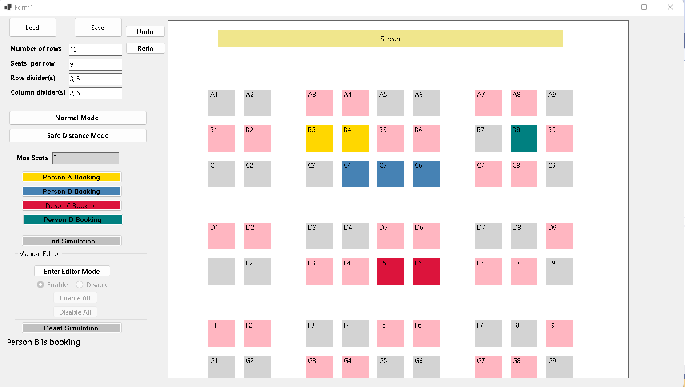

# Seat Booking Simulator
Data Structure and Algorithm


+ Normal Mode
+ Safe Distance Mode

###
Open ``` SeatBookingSimulator.sln``` from the root folder using Visual Studio 2022. 
> Then click Play or press F5

### Screenshots

